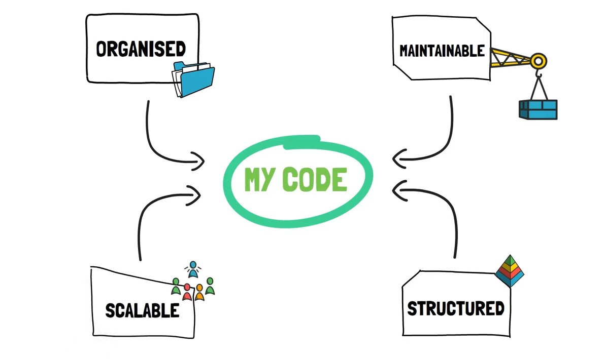
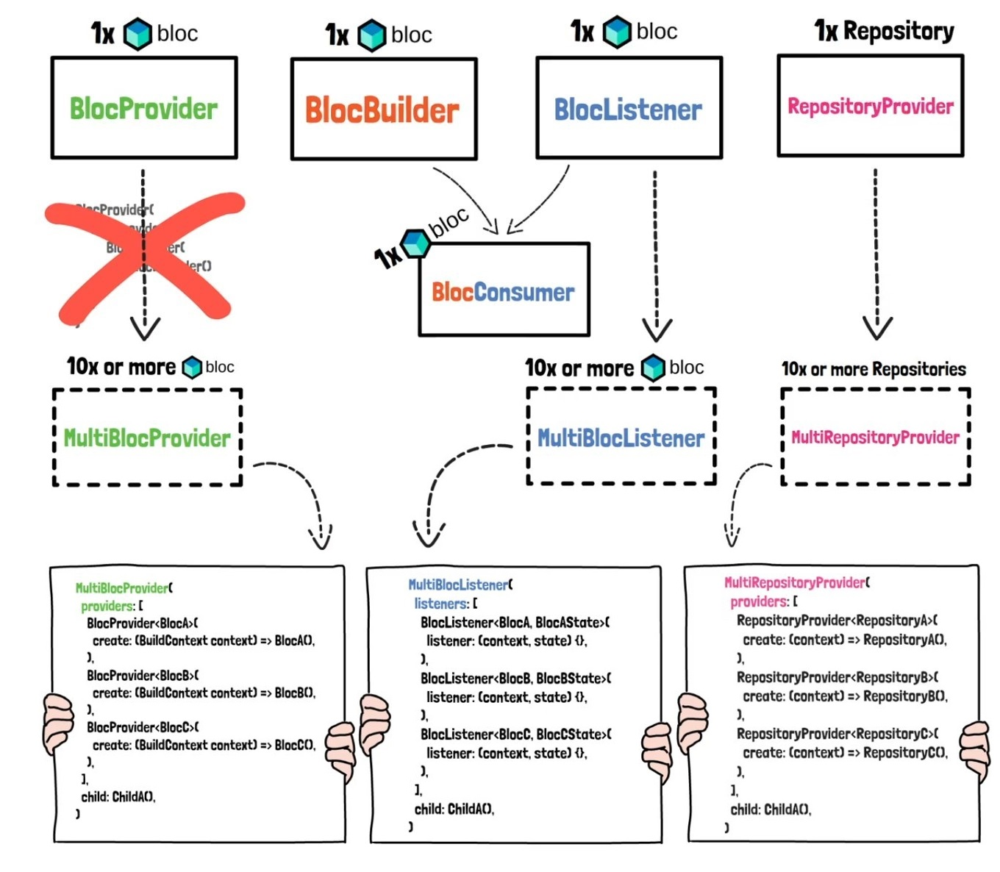

# Flutter Application using BLoC
A BLoC pattern is design pattern created by Google to seperate the UI from Business logic.

## BLoC {Business Locgic Component}

### Why BLoC?
* BLoC as Design Pattern and StateManagement
* Knowing the STATE of app is CRUCIAL
* Presentation Layer & Logic behind it

### Advantages of using BLoC?
* Understand easily what's happening inside the app
* More structured code, easier to maintain and test
* Know & understand every state of the app
* Work on a single, stable, popular and effective BLoC codebase

    

## The main Differnt between BLoC Widgets

    

------------------------------------------------------------------------------

# How can we provide the existing cubit/instance to another SCREEN?

<dev>
    
Providing an instance of bloc/cubit to <i>A SINGLE SCREEN</i> is called <strong>LOCAL ACCESS</strong>

</dev>
<dev>
    
Providing an instance of bloc/cubit to <i>MULTIPLE SCREENs</i> is called <strong>ROUTE ACCESS</strong>

</dev>

<dev>
    
Navigation with ROUTES: requires

    <ul>
        <li>ROUTE Name</li>
        <li>The associated PAGE/SCREEN</li>
    </ul>
</dev>

<table>
  <tr>
    <th colspan="3" style= "font-weight:bold">Flutter Routing Options</th>
  </tr>
  <tr>
    <td>Anonymous Routing</td>
    <td>Named Routing</td>
    <td>Generated Routing</td>
  </tr>
  <tr>
    <td>Routing without Name</td>
    <td>Navigation With a Route Name</td>
    <td>Navigation With a Route Name</td>
  </tr>
  <tr>
    <td>Only the SCREENS are used to navigate</td>
    <td>ROUTES NAMES and their associated SCREENS are set up inside routes parameter of MaterialApp widget</td>
    <td>ROUTES NAMES and their associated SCREENS are set up inside a seperate onGenerateRoute function</td>
  </tr>
  <tr>
    <td>Suitable for SMALL applications</td>
    <td>Suitable for SMALL-MEDIUM applications</td>
    <td>Suitable for LARGE applications</td>
  </tr>
</table>

<ul>
    <li>
        <dev>
            
You can NAVIGATE inside Flutter by using

            <ol type="I">
                <li>Anonymous Routing (recmmended for SMALL projects)</li>
                <li>Named Routing (recmmended for MEDIUM projects)</li>
                <li>Generated Routing (recmmended for LARGE projects)</li> 
            </ol>
        </dev>
    </li>
    <li>The key is to provide a UNIQUE INSTANCE of a bloc/cubit.</li>
    <li>You SHOULDONT create MULTIPLE INSTANCES of the same bloc/cubit.</li>
    <li>BlocProvider() CREATES & PROVIDES a NEW INSTANCE of a bloc/cubit.</li>
    <li>BlocProvider.value() takes an ALREADY CREATED INSTANCE and then PROVIDES it further.</li>
    <li>
     <dev>
            
You can PROVIDE your cubit/bloc INSTANCES

            <ol type="I">
                <li>LOCALLY-when you want to provide the instance to A SINGLE SCREEN</li>
                <li>SPECIFICALLY-when you want to SPECIFICALLY PROVIDE the instance across one or more SCREENS</li>
                <li>GLOBALLY-when you want to provide the instance ACROSS ALL OF YOUR SCREENS</li> 
            </ol>
        </dev>
    </li>
</ul>

